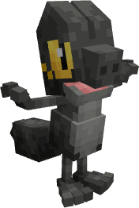
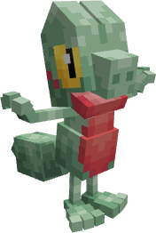

---
layout:
  width: wide
  title:
    visible: true
  description:
    visible: false
  tableOfContents:
    visible: true
  outline:
    visible: true
  pagination:
    visible: true
  metadata:
    visible: true
  tags:
    visible: true
  actions:
    visible: true
---

# #2001 - Oloriański Treecko


{% column width="50%" %}
<a href="./" class="button secondary small">&#x3C;——–</a>

Zobacz jak wygląda (Spoiler)

<figure><figcaption></figcaption></figure>

SHINY!! (Spoiler)

<figure><figcaption></figcaption></figure>



{% column width="50.000000000000014%" %}
***

<mark style="color:$info;">Gatunek</mark> Pokémon Cień

***

<mark style="color:$info;">Waga</mark> 5.0 kg (11.0 lbs)

***

<mark style="color:$info;">Type</mark>  Dark

***

<mark style="color:$info;">Abilities</mark> Insomnia[^1]\
&#x20;             Infiltrator[^2] <mark style="color:$info;">(Hidden Ability)</mark>

***

<mark style="color:$info;">Local №</mark> #0001

***



### **Bazowe statystyki**

***


{% column width="16.666666666666664%" %}

<mark style="color:$info;">HP</mark>



{% column width="8.333333333333334%" %}
40


{% column width="75%" %}
▮▮▮▮



***


{% column width="16.666666666666664%" %}

<mark style="color:$info;">Attack</mark>



{% column width="8.333333333333334%" %}
70


{% column width="75%" %}
▮▮▮▮▮▮▮



***


{% column width="16.666666666666664%" %}

<mark style="color:$info;">Defence</mark>



{% column width="8.333333333333334%" %}
35


{% column width="75%" %}
▮▮▮▮



***


{% column width="16.666666666666664%" %}

<mark style="color:$info;">Sp. Atk</mark>



{% column width="8.333333333333334%" %}
35


{% column width="75%" %}
▮▮▮▮



***


{% column width="16.666666666666664%" %}

<mark style="color:$info;">Sp. Def</mark>



{% column width="8.333333333333334%" %}
55


{% column width="75%" %}
▮▮▮▮▮▮



***


{% column width="16.666666666666664%" %}

<mark style="color:$info;">Speed</mark>



{% column width="8.333333333333334%" %}
75


{% column width="75%" %}
▮▮▮▮▮▮▮▮



***


{% column width="16.666666666666664%" %}

<mark style="color:$info;">Total</mark>



{% column width="16.666666666666664%" %}
**310**


{% column width="66.66666666666667%" %}




### **Odporności na inne typy**

<mark style="color:$info;">Efektywność każdego typu na Treecko<mark style="color:$info;">

<table data-header-hidden><thead><tr><th width="80" align="center"></th><th width="80" align="center"></th><th width="80" align="center"></th><th width="80" align="center"></th><th width="80" align="center"></th><th width="80" align="center"></th><th width="80" align="center"></th><th width="80" align="center"></th><th width="80" align="center"></th></tr></thead><tbody><tr><td align="center"></td><td align="center"></td><td align="center"></td><td align="center"></td><td align="center"></td><td align="center"></td><td align="center"></td><td align="center"></td><td align="center"></td></tr><tr><td align="center"></td><td align="center"></td><td align="center"></td><td align="center"></td><td align="center"></td><td align="center"></td><td align="center"><mark style="color:$success;">2</mark></td><td align="center"></td><td align="center"></td></tr><tr><td align="center"></td><td align="center"></td><td align="center"></td><td align="center"></td><td align="center"></td><td align="center"></td><td align="center"></td><td align="center"></td><td align="center"></td></tr><tr><td align="center"></td><td align="center"><mark style="color:$info;">0</mark></td><td align="center"><mark style="color:$success;">2</mark></td><td align="center"></td><td align="center"><mark style="color:$warning;">½</mark></td><td align="center"></td><td align="center"><mark style="color:$warning;">½</mark></td><td align="center"></td><td align="center"><mark style="color:$success;">2</mark></td></tr></tbody></table>

### **Drzewko ewolucyjne**

<h4 align="center"><a href="2001-olorianski-treecko.md">Treecko</a>     —>     <a href="2002-olorianski-grovyle.md">Grovyle</a>     —>     <a href="2003-olorianski-sceptile.md">Sceptile</a>           (Level 16)           (Level 36)      </h4>



### **Trening**

<mark style="color:$info;">EV Yield</mark> 1 Speed

<mark style="color:$info;">Catch Rate</mark> 45 <mark style="color:$info;">(5.9% with Pokeball, Full HP)</mark>



### **Breeding**

<mark style="color:$info;">Egg Groups</mark> Dragon, Monster

<mark style="color:$info;">Gender</mark> <mark style="color:blue;">87.5% male</mark>, <mark style="color:pink;">12.5% female</mark>



<h3 align="center"><strong>Ruchy Treecko</strong></h3>



#### Uczone poprzez Level-Up

<mark style="color:$info;">1</mark>   Pound\
<mark style="color:$info;">1</mark>   Leer\
<mark style="color:$info;">3</mark>   Bite\
<mark style="color:$info;">6</mark>   Quick Attack\
<mark style="color:$info;">9</mark>   Pursuit\
<mark style="color:$info;">12</mark>   Thunder Wave\
<mark style="color:$info;">18</mark>   Quick Guard\
<mark style="color:$info;">21</mark>   Assurance\
<mark style="color:$info;">24</mark>   Detect\
<mark style="color:$info;">27</mark>   Wild Charge\
<mark style="color:$info;">30</mark>   Crunch\
<mark style="color:$info;">33</mark>   Screech\
<mark style="color:$info;">36</mark>   Taunt\
<mark style="color:$info;">39</mark>   Breaking Swipe



#### Uczone poprzez TM

Ekskluzywne dla regionalnej formy:

 Nuzzle\
 Throat Chop\
 Thunder Wave\
 Volt Switch\
 Wild Charge

#### Reszte można sprawdzić na [Pokemon Database](https://pokemondb.net/pokedex/treecko)

<mark style="color:$info;">Wszystkie ruchy są dodawane ręcznie, dlatego reszta nie została wypisana<mark style="color:$info;">



[^1]: _Insomnia_ uniemożliwia posiadaczowi zapadnięcie w sen – zarówno w wyniku działania ruchów innych Pokémonów (takich jak Sing), jak i w przypadku prób samodzielnego wywołania snu (np. poprzez ruch Rest).

[^2]: _Infiltrator_ ignoruje działanie ruchów Reflect, Light Screen oraz Safeguard. Innymi słowy, jeśli przeciwnik użył Safeguard, ruch Toxic nadal spowoduje u niego silne zatrucie (badly poisoned).
