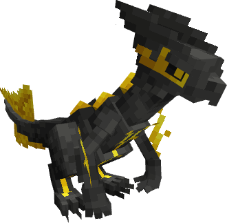
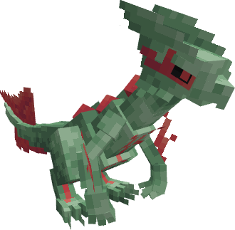

---
layout:
  width: wide
  title:
    visible: true
  description:
    visible: false
  tableOfContents:
    visible: true
  outline:
    visible: true
  pagination:
    visible: true
  metadata:
    visible: true
  tags:
    visible: true
  actions:
    visible: true
---

# #2003 - Oloriański Sceptile


{% column width="50%" %}
<a href="./" class="button secondary small">&#x3C;——–</a>

Zobacz Jak Wygląda (Spoiler)

<figure><figcaption></figcaption></figure>

SHINY!! (Spoiler)

<figure><figcaption></figcaption></figure>



{% column width="50.000000000000014%" %}
***

<mark style="color:$info;">Gatunek</mark> Pokemon Paraliż Senny

***

<mark style="color:$info;">Waga</mark> 42.2 kg (93.0 lbs)

***

<mark style="color:$info;">Type</mark>  Dark /  Electric

***

<mark style="color:$info;">Abilities</mark> Insomnia[^1]\
&#x20;             Infiltrator[^2] <mark style="color:$info;">(Hidden Ability)</mark>

***

<mark style="color:$info;">Local №</mark> #0003

***



### **Bazowe Statystyki**

***


{% column width="16.666666666666664%" %}

<mark style="color:$info;">HP</mark>



{% column width="8.333333333333334%" %}
70


{% column width="50%" %}
▮▮▮▮▮▮▮


{% column width="25%" %}
250 344



***


{% column width="16.666666666666664%" %}

<mark style="color:$info;">Attack</mark>



{% column width="8.333333333333334%" %}
110


{% column width="50%" %}
▮▮▮▮▮▮▮▮▮▮▮


{% column width="24.999999999999996%" %}
202 350



***


{% column width="16.666666666666664%" %}

<mark style="color:$info;">Defence</mark>



{% column width="8.333333333333334%" %}
70


{% column width="50%" %}
▮▮▮▮▮▮▮


{% column width="24.999999999999996%" %}
130 262



***


{% column width="16.666666666666664%" %}

<mark style="color:$info;">Sp. Atk</mark>



{% column width="8.333333333333334%" %}
75


{% column width="50%" %}
▮▮▮▮▮▮▮▮


{% column width="24.999999999999996%" %}
139 273



***


{% column width="16.666666666666664%" %}

<mark style="color:$info;">Sp. Def</mark>



{% column width="8.333333333333334%" %}
75


{% column width="50%" %}
▮▮▮▮▮▮▮▮


{% column width="24.999999999999996%" %}
139 273



***


{% column width="16.666666666666664%" %}

<mark style="color:$info;">Speed</mark>



{% column width="8.333333333333334%" %}
130


{% column width="50%" %}
▮▮▮▮▮▮▮▮▮▮▮▮▮


{% column width="24.999999999999996%" %}
238 394



***


{% column width="16.666666666666664%" %}

<mark style="color:$info;">Total</mark>



{% column width="16.666666666666664%" %}
**530**


{% column width="41.66666666666667%" %}



{% column width="24.999999999999996%" %}
<mark style="color:$info;">Min Max</mark>



### **Drzewko Ewolucyjne**

<h4 align="center">Treecko     —>     Grovyle     —>     Sceptile           (Level 16)           (Level 36)      </h4>



### **Trening**

<mark style="color:$info;">EV Yield</mark> 3 Speed

<mark style="color:$info;">Catch Rate</mark> 45 <mark style="color:$info;">(5.9% with Pokeball, Full HP)</mark>



### **Breeding**

<mark style="color:$info;">Egg Groups</mark> Dragon, Monster

<mark style="color:$info;">Gender</mark> <mark style="color:blue;">87.5% male</mark>, <mark style="color:pink;">12.5% female</mark>



<h3 align="center"><strong>Ruchy Sceptile'a</strong></h3>



#### Uczone Poprzez Ewolucje

 [Dread Current](#user-content-fn-3)[^3]

#### Uczone Poprzez Level-Up

<mark style="color:$info;">1</mark>   Night Slash\
<mark style="color:$info;">1</mark>   Pound\
<mark style="color:$info;">1</mark>   Leer\
<mark style="color:$info;">1</mark>   Bite\
<mark style="color:$info;">1</mark>   Quick Attack\
<mark style="color:$info;">1</mark>   X-Scissor\
<mark style="color:$info;">1</mark>   Pursuit\
<mark style="color:$info;">1</mark>   Thunder Shock\
<mark style="color:$info;">1</mark>   Agility\
<mark style="color:$info;">1</mark>  False Swipe\
<mark style="color:$info;">1</mark>   Fury Cutter\
<mark style="color:$info;">1</mark>   Spark\
<mark style="color:$info;">1</mark>   Dual Chop\
<mark style="color:$info;">1</mark>  Shed Tail\
<mark style="color:$info;">5</mark>   Thunder Wave\
<mark style="color:$info;">12</mark>   Volt Switch\
<mark style="color:$info;">15</mark>   Quick Guard\
<mark style="color:$info;">20</mark>   Assurance\
<mark style="color:$info;">25</mark>   Detect\
<mark style="color:$info;">30</mark>   Wild Charge\
<mark style="color:$info;">35</mark>   Crunch\
<mark style="color:$info;">42</mark>   Screech\
<mark style="color:$info;">49</mark>   Taunt\
<mark style="color:$info;">56</mark>   Breaking Swipe



#### Uczone Poprzez TM

Ekskluzywne Dla Regionalnej Formy:

 Nuzzle\
 Throat Chop\
 Thunder Wave\
 Volt Switch\
 Wild Charge

#### Reszte Można Sprawdzić Na [Pokemon Database](https://pokemondb.net/pokedex/sceptile)

<mark style="color:$info;">Wszystkie Ruchy Są Dodawane Ręcznie, Dlatego Reszta Nie Została Wypisana<mark style="color:$info;">



[^1]: _Insomnia_ prevents the ability-bearer from falling asleep, both from moves by other Pokémon like Sing, and self-inflicted sleep like Rest.

[^2]: _Infiltrator_ ignores the effects of Reflect, Light Screen and Safeguard. In other words, if the opponent has used Safeguard, Toxic would still badly poison them.

[^3]: **| 60 BP | 10 PP | 100% Accuracy |** _Dread Current_ deals damage and has a 30% chance chance of paralyzed the target. If the target is already paralyzed, its power is doubled.
