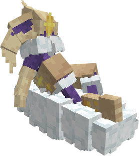
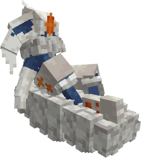

---
layout:
  width: wide
  title:
    visible: true
  description:
    visible: false
  tableOfContents:
    visible: true
  outline:
    visible: true
  pagination:
    visible: true
  metadata:
    visible: true
  tags:
    visible: true
  actions:
    visible: true
---

# #2006 - Oloriański Cinderace


{% column width="50%" %}
<a href="./" class="button secondary small">&#x3C;—––</a>

Zobacz jak wygląda (Spoiler)

<figure><figcaption></figcaption></figure>

SHINY!! (Spoiler)

<figure><figcaption></figcaption></figure>



{% column width="50.000000000000014%" %}
***

<mark style="color:$info;">Gatunek</mark> Pokémon Astralny Śniący

***

<mark style="color:$info;">Waga</mark> 33.0 kg (72.8 lbs)

***

<mark style="color:$info;">Type</mark>  Psychic /  Flying

***

<mark style="color:$info;">Abilities</mark> [Magic Guard](#user-content-fn-1)[^1]\
&#x20;             Comatose[^2] <mark style="color:$info;">(Hidden Ability)</mark>

***

<mark style="color:$info;">Local №</mark> #0006

***



### **Bazowe statystyki**

***


{% column width="16.666666666666664%" %}

<mark style="color:$info;">HP</mark>



{% column width="8.333333333333334%" %}
75


{% column width="75%" %}
▮▮▮▮▮▮▮▮



***


{% column width="16.666666666666664%" %}

<mark style="color:$info;">Attack</mark>



{% column width="8.333333333333334%" %}
70


{% column width="75%" %}
▮▮▮▮▮▮▮



***


{% column width="16.666666666666664%" %}

<mark style="color:$info;">Defence</mark>



{% column width="8.333333333333334%" %}
70


{% column width="75%" %}
▮▮▮▮▮▮▮



***


{% column width="16.666666666666664%" %}

<mark style="color:$info;">Sp. Atk</mark>



{% column width="8.333333333333334%" %}
125


{% column width="75%" %}
▮▮▮▮▮▮▮▮▮▮▮▮▮



***


{% column width="16.666666666666664%" %}

<mark style="color:$info;">Sp. Def</mark>



{% column width="8.333333333333334%" %}
80


{% column width="75%" %}
▮▮▮▮▮▮▮▮



***


{% column width="16.666666666666664%" %}

<mark style="color:$info;">Speed</mark>



{% column width="8.333333333333334%" %}
110


{% column width="75%" %}
▮▮▮▮▮▮▮▮▮▮▮



***


{% column width="16.666666666666664%" %}

<mark style="color:$info;">Total</mark>



{% column width="16.666666666666664%" %}
**530**


{% column width="66.66666666666667%" %}




### **Odporności na inne typy**

<mark style="color:$info;">Efektywność każdego typu na Cinderace'a<mark style="color:$info;">

<table data-header-hidden><thead><tr><th width="80" align="center"></th><th width="80" align="center"></th><th width="80" align="center"></th><th width="80" align="center"></th><th width="80" align="center"></th><th width="80" align="center"></th><th width="80" align="center"></th><th width="80" align="center"></th><th width="80" align="center"></th></tr></thead><tbody><tr><td align="center"></td><td align="center"></td><td align="center"></td><td align="center"></td><td align="center"></td><td align="center"></td><td align="center"></td><td align="center"></td><td align="center"></td></tr><tr><td align="center"></td><td align="center"></td><td align="center"></td><td align="center"><mark style="color:$success;">2</mark></td><td align="center"><mark style="color:$warning;">½</mark></td><td align="center"><mark style="color:$success;">2</mark></td><td align="center"><mark style="color:$danger;">¼</mark></td><td align="center"></td><td align="center"><mark style="color:$info;">0</mark></td></tr><tr><td align="center"></td><td align="center"></td><td align="center"></td><td align="center"></td><td align="center"></td><td align="center"></td><td align="center"></td><td align="center"></td><td align="center"></td></tr><tr><td align="center"></td><td align="center"><mark style="color:$warning;">½</mark></td><td align="center"></td><td align="center"><mark style="color:$success;">2</mark></td><td align="center"><mark style="color:$success;">2</mark></td><td align="center"></td><td align="center"><mark style="color:$success;">2</mark></td><td align="center"></td><td align="center"></td></tr></tbody></table>

### **Drzewko ewolucyjne**

<h4 align="center">Scorbunny     —>     Raboot     —>     Cinderace                 (Level 16)                (Level 35)          </h4>



### **Trening**

<mark style="color:$info;">EV Yield</mark> 3 Sp. Def

<mark style="color:$info;">Catch Rate</mark> 45 <mark style="color:$info;">(5.9% with Pokeball, Full HP)</mark>



### **Breeding**

<mark style="color:$info;">Egg Groups</mark> Field, Human-Like

<mark style="color:$info;">Gender</mark> <mark style="color:blue;">87.5% male</mark>, <mark style="color:pink;">12.5% female</mark>



<h3 align="center"><strong>Ruchy Cinderace'a</strong></h3>



#### Uczone poprzez ewolucje

 [Astral Drift](#user-content-fn-3)[^3]

#### Uczone poprzez Level-Up

<mark style="color:$info;">1</mark>   Gust\
<mark style="color:$info;">1</mark>   Tackle\
<mark style="color:$info;">1</mark>   Growl\
<mark style="color:$info;">1</mark>   Confusion\
<mark style="color:$info;">1</mark>   Quick Attack\
<mark style="color:$info;">12</mark>   Double Kick\
<mark style="color:$info;">16</mark>   Psybeam\
<mark style="color:$info;">19</mark>   Air Cutter\
<mark style="color:$info;">24</mark>   Agility\
<mark style="color:$info;">30</mark>   Psyshock\
<mark style="color:$info;">36</mark>   Air Slash\
<mark style="color:$info;">40</mark>   Calm Mind\
<mark style="color:$info;">46</mark>   Psychic\
<mark style="color:$info;">54</mark>   Hurricane



#### Uczone poprzez TM

Ekskluzywne dla regionalnej formy:

 Calm Mind\
 Dram Eater\
 Hypnosis\
 Rest\
 Roost\
 Shadow Ball\
 Snore\
 Tailwind

#### Reszte można sprawdzić na [Pokemon Database](https://pokemondb.net/pokedex/cinderace)

<mark style="color:$info;">Wszystkie ruchy są dodawane ręcznie, dlatego reszta nie została wypisana<mark style="color:$info;">



[^1]: _Magic Guard_ chroni Pokémona przed obrażeniami pośrednimi.

[^2]: _Comatose_ sprawia, że ​​Pokémon zachowuje się tak, jakby spał, choć technicznie nie posiada statusu snu. Może on nadal używać swoich zwykłych ruchów, ale nie może zostać dotknięty żadnym z głównych stanów (sen, zatrucie, paraliż, oparzenie czy zamrożenie).

[^3]: **| 80 BP | 10 PP | 90% Accuracy |** _Astral Drift_ zadaje obrażenia i zwiększa Sp. Def użytkownika o jeden poziom.
