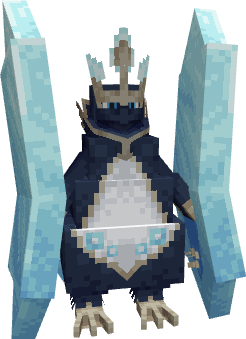
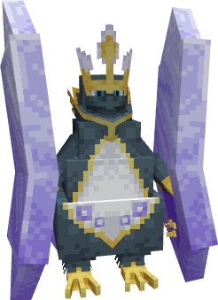

---
layout:
  width: wide
  title:
    visible: true
  description:
    visible: false
  tableOfContents:
    visible: true
  outline:
    visible: true
  pagination:
    visible: true
  metadata:
    visible: true
  tags:
    visible: true
  actions:
    visible: true
  anchors:
    visible: true
---

# #2018 - Struthioroc


{% column width="50%" %}
<a href="./" class="button secondary small">&#x3C;—––</a>

Zobacz jak wygląda (Spoiler)

<figure><figcaption></figcaption></figure>

SHINY!! (Spoiler)

<figure><figcaption></figcaption></figure>



{% column width="50.000000000000014%" %}
***

<mark style="color:$info;">Gatunek</mark> Pokémon Struś

***

<mark style="color:$info;">Waga</mark> 210.0 kg (462.9 lbs)

***

<mark style="color:$info;">Type</mark>  Rock /  Normal

***

<mark style="color:$info;">Abilities</mark> Rock Face

***

<mark style="color:$info;">Local №</mark> #0018

***

<mark style="color:$info;">Spawn</mark> Badlands (ig) - Rare

***



### **Bazowe statystyki**


{% column width="16.666666666666664%" %}

<mark style="color:$info;">HP</mark>



{% column width="8.333333333333334%" %}
95


{% column width="75%" %}
▮▮▮▮▮▮▮▮▮▮



***


{% column width="16.666666666666664%" %}

<mark style="color:$info;">Attack</mark>



{% column width="8.333333333333334%" %}
110


{% column width="75%" %}
▮▮▮▮▮▮▮▮▮▮▮



***


{% column width="16.666666666666664%" %}

<mark style="color:$info;">Defence</mark>



{% column width="8.333333333333334%" %}
100


{% column width="75%" %}
▮▮▮▮▮▮▮▮▮▮



***


{% column width="16.666666666666664%" %}

<mark style="color:$info;">Sp. Atk</mark>



{% column width="8.333333333333334%" %}
55


{% column width="75%" %}
▮▮▮▮▮▮



***


{% column width="16.666666666666664%" %}

<mark style="color:$info;">Sp. Def</mark>



{% column width="8.333333333333334%" %}
125


{% column width="75%" %}
▮▮▮▮▮▮▮▮▮▮▮▮▮



***


{% column width="16.666666666666664%" %}

<mark style="color:$info;">Speed</mark>



{% column width="8.333333333333334%" %}
45


{% column width="75%" %}
▮▮▮▮▮



***


{% column width="16.666666666666664%" %}

<mark style="color:$info;">Total</mark>



{% column width="16.666666666666664%" %}
**530**


{% column width="66.66666666666667%" %}




### Statystyki No-Face


{% column width="16.666666666666664%" %}

<mark style="color:$info;">HP</mark>



{% column width="8.333333333333334%" %}
95


{% column width="75%" %}
▮▮▮▮▮▮▮▮▮▮



***


{% column width="16.666666666666664%" %}

<mark style="color:$info;">Attack</mark>



{% column width="8.333333333333334%" %}
110


{% column width="75%" %}
▮▮▮▮▮▮▮▮▮▮▮



***


{% column width="16.666666666666664%" %}

<mark style="color:$info;">Defence</mark>



{% column width="8.333333333333334%" %}
80


{% column width="75%" %}
▮▮▮▮▮▮▮▮



***


{% column width="16.666666666666664%" %}

<mark style="color:$info;">Sp. Atk</mark>



{% column width="8.333333333333334%" %}
55


{% column width="75%" %}
▮▮▮▮▮▮



***


{% column width="16.666666666666664%" %}

<mark style="color:$info;">Sp. Def</mark>



{% column width="8.333333333333334%" %}
75


{% column width="75%" %}
▮▮▮▮▮▮▮▮



***


{% column width="16.666666666666664%" %}

<mark style="color:$info;">Speed</mark>



{% column width="8.333333333333334%" %}
115


{% column width="75%" %}
▮▮▮▮▮▮▮▮▮▮▮▮



***


{% column width="16.666666666666664%" %}

<mark style="color:$info;">Total</mark>



{% column width="16.666666666666664%" %}
**530**


{% column width="66.66666666666667%" %}




### **Odporności na inne typy**

<mark style="color:$info;">Efektywność każdego typu na Struthioroc'a<mark style="color:$info;">

<table data-header-hidden><thead><tr><th width="80" align="center"></th><th width="80" align="center"></th><th width="80" align="center"></th><th width="80" align="center"></th><th width="80" align="center"></th><th width="80" align="center"></th><th width="80" align="center"></th><th width="80" align="center"></th><th width="80" align="center"></th></tr></thead><tbody><tr><td align="center"></td><td align="center"></td><td align="center"></td><td align="center"></td><td align="center"></td><td align="center"></td><td align="center"></td><td align="center"></td><td align="center"></td></tr><tr><td align="center"><mark style="color:$warning;">½</mark></td><td align="center"><mark style="color:$warning;">½</mark></td><td align="center"><mark style="color:$success;">2</mark></td><td align="center"></td><td align="center"><mark style="color:$success;">2</mark></td><td align="center"></td><td align="center"><mark style="color:green;">4</mark></td><td align="center"><mark style="color:$warning;">½</mark></td><td align="center"><mark style="color:$success;">2</mark></td></tr><tr><td align="center"></td><td align="center"></td><td align="center"></td><td align="center"></td><td align="center"></td><td align="center"></td><td align="center"></td><td align="center"></td><td align="center"></td></tr><tr><td align="center"><mark style="color:$warning;">½</mark></td><td align="center"></td><td align="center"></td><td align="center"></td><td align="center"><mark style="color:$info;">0</mark></td><td align="center"></td><td align="center"></td><td align="center"><mark style="color:$success;">2</mark></td><td align="center"></td></tr></tbody></table>

### **Drzewko ewolucyjne**

<h4 align="center"><a href="2017-geoscue.md">Geoscue</a>     —>     <a href="2018-struthioroc.md">Struthioroc</a>            (Level 38)           </h4>



### **Trening**

<mark style="color:$info;">EV Yield</mark> 3 Sp. Def

<mark style="color:$info;">Catch Rate</mark> 60 <mark style="color:$info;">(7.8% with Pokeball, Full HP)</mark>



### **Breeding**

<mark style="color:$info;">Egg Groups</mark> Field, Mineral

<mark style="color:$info;">Gender</mark> <mark style="color:blue;">50% male</mark>, <mark style="color:pink;">50% female</mark>



<h3 align="center"><strong>Ruchy</strong> Struthioroc<strong>'a</strong></h3>


{% column width="50%" %}
#### Uczone poprzez Ewolucje

 Boulder Charge

#### Uczone poprzez Level-Up

<mark style="color:$info;">1</mark>   Mud-Slap\ <mark style="color:$info;">1</mark>   Tackle\
<mark style="color:$info;">6</mark>   Rock Throw\
<mark style="color:$info;">12</mark>   Weather Ball\
<mark style="color:$info;">18</mark>   Rock Tomb\
<mark style="color:$info;">24</mark>   Headbutt\
<mark style="color:$info;">30</mark>   Amnesia\
<mark style="color:$info;">36</mark>   Sandstorm\
<mark style="color:$info;">44</mark>   Rock Slide\
<mark style="color:$info;">52</mark>   Body Slam\
<mark style="color:$info;">60</mark>   High Horsepower\
<mark style="color:$info;">68</mark>   Stone Edge

#### Uczone poprzez Breeding

 Camouflage\
 Double-Edge\
 Head Smash\
 Roost\
 Rototiller\
 Stomping Tantrum 


{% column width="50%" %}
#### Uczone poprzez TM

 Agility\
 Amnesia\
 Body Press\
 Body Slam\
 Bulldoze\
 Curse\
 Dig\
 Double-Edge\
 Drill Run\
Earth Power\
 Earthquake\
 Endure\
 Facade\
 Feather Dance\
 Giga Impact\
 Heat Wave\
 Heavy Slam\
 High Horsepower\
 Hyper Beam\
 Iron Defense\
 Iron Head\
 Light Screen\
 Meteor Beam\
 Protect\
 Rest\
 Reversal\
 Roar\
 Rock Blast\
 Rock Slide\
 Rock Tomb\
 Sandstorm\
 Scorching Sands\
 Sleep Talk\
 Spikes\
 Stealth Rock\
 Stone Edge\
 Substitute\
 Take Down\
 Tera Blast\
 Trailblaze\
 Weather Ball\
 Zen Headbutt


