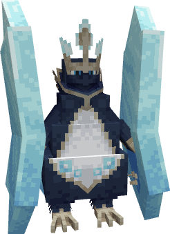
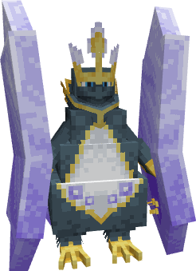

---
layout:
  width: wide
  title:
    visible: true
  description:
    visible: false
  tableOfContents:
    visible: true
  outline:
    visible: true
  pagination:
    visible: true
  metadata:
    visible: true
  tags:
    visible: true
  actions:
    visible: true
  anchors:
    visible: true
---

# #2019 - Moltmor


{% column width="50%" %}
<a href="./" class="button secondary small">&#x3C;—––</a>

Zobacz jak wygląda (Spoiler)

<figure><figcaption></figcaption></figure>

SHINY!! (Spoiler)

<figure><figcaption></figcaption></figure>



{% column width="50.000000000000014%" %}
***

<mark style="color:$info;">Gatunek</mark> Pokémon Mrówkojad

***

<mark style="color:$info;">Waga</mark> 126.0 kg (277.8 lbs)

***

<mark style="color:$info;">Type</mark>  Fire

***

<mark style="color:$info;">Abilities</mark> [Tough Claws](#user-content-fn-1)[^1]\
&#x20;             [Flash Fire](#user-content-fn-2)[^2]\
&#x20;             [White Smoke](#user-content-fn-3)[^3] <mark style="color:$info;">(Hidden Ability)</mark>

***

<mark style="color:$info;">Local №</mark> #0019

***

<mark style="color:$info;">Spawn</mark> Nether\* - Rare

***



### **Bazowe statystyki**

***


{% column width="16.666666666666664%" %}

<mark style="color:$info;">HP</mark>



{% column width="8.333333333333334%" %}
90


{% column width="75%" %}
▮▮▮▮▮▮▮▮



***


{% column width="16.666666666666664%" %}

<mark style="color:$info;">Attack</mark>



{% column width="8.333333333333334%" %}
115


{% column width="75%" %}
▮▮▮▮▮▮▮▮▮▮▮▮



***


{% column width="16.666666666666664%" %}

<mark style="color:$info;">Defence</mark>



{% column width="8.333333333333334%" %}
85


{% column width="75%" %}
▮▮▮▮▮▮▮▮▮



***


{% column width="16.666666666666664%" %}

<mark style="color:$info;">Sp. Atk</mark>



{% column width="8.333333333333334%" %}
120


{% column width="75%" %}
▮▮▮▮▮▮▮▮▮▮▮▮



***


{% column width="16.666666666666664%" %}

<mark style="color:$info;">Sp. Def</mark>



{% column width="8.333333333333334%" %}
85


{% column width="75%" %}
▮▮▮▮▮▮▮▮▮



***


{% column width="16.666666666666664%" %}

<mark style="color:$info;">Speed</mark>



{% column width="8.333333333333334%" %}
45


{% column width="75%" %}
▮▮▮▮▮



***


{% column width="16.666666666666664%" %}

<mark style="color:$info;">Total</mark>



{% column width="16.666666666666664%" %}
**540**


{% column width="66.66666666666667%" %}




### **Odporności na inne typy**

<mark style="color:$info;">Efektywność każdego typu na Moltmor'a<mark style="color:$info;">

<table data-header-hidden><thead><tr><th width="80" align="center"></th><th width="80" align="center"></th><th width="80" align="center"></th><th width="80" align="center"></th><th width="80" align="center"></th><th width="80" align="center"></th><th width="80" align="center"></th><th width="80" align="center"></th><th width="80" align="center"></th></tr></thead><tbody><tr><td align="center"></td><td align="center"></td><td align="center"></td><td align="center"></td><td align="center"></td><td align="center"></td><td align="center"></td><td align="center"></td><td align="center"></td></tr><tr><td align="center"></td><td align="center"><mark style="color:$warning;">½</mark></td><td align="center"><mark style="color:$success;">2</mark></td><td align="center"></td><td align="center"><mark style="color:$warning;">½</mark></td><td align="center"><mark style="color:$warning;">½</mark></td><td align="center"></td><td align="center"></td><td align="center"><mark style="color:$success;">2</mark></td></tr><tr><td align="center"></td><td align="center"></td><td align="center"></td><td align="center"></td><td align="center"></td><td align="center"></td><td align="center"></td><td align="center"></td><td align="center"></td></tr><tr><td align="center"></td><td align="center"></td><td align="center"><mark style="color:$warning;">½</mark></td><td align="center"><mark style="color:$success;">2</mark></td><td align="center"></td><td align="center"></td><td align="center"></td><td align="center"><mark style="color:$warning;">½</mark></td><td align="center"><mark style="color:$warning;">½</mark></td></tr></tbody></table>

### **Drzewko ewolucyjne**

<h4 align="center"><a href="https://pokemondb.net/pokedex/heatmor">Heatmor</a>     —>     <a href="2019-moltmor.md">Moltmor</a>      (level)     </h4>



### **Trening**

<mark style="color:$info;">EV Yield</mark> 2 Sp. Atk

<mark style="color:$info;">Catch Rate</mark> 45 <mark style="color:$info;">(5.9% with Pokeball, Full HP)</mark>



### **Breeding**

<mark style="color:$info;">Egg Groups</mark> Field

<mark style="color:$info;">Gender</mark> <mark style="color:blue;">50% male</mark>, <mark style="color:pink;">50% female</mark>



<h3 align="center"><strong>Ruchy Moltmor'a</strong></h3>



#### Uczone poprzez Ewolucje

 Struggle Bug

#### Uczone poprzez Level-Up

<mark style="color:$info;">1</mark>   Baton Pass



#### Uczone poprzez TM

Ekskluzywne dla regionalnej formy:

 Focus Blast\
 Low Sweep\
 Mist\
 Misty Terrain\
 Wave Crash

#### Reszte można sprawdzić na [Pokemon Database](https://pokemondb.net/pokedex/empoleon)

<mark style="color:$info;">Wszystkie ruchy są dodawane ręcznie, dlatego reszta nie została wypisana<mark style="color:$info;">



[^1]: _Tough Claws_ zwiększa moc ruchów kontaktowych

[^2]: Kiedy Pokémon z _Flash Fire_ jest uderzony przez Fire-type ruch, nie dostaje obrażeń ale zwiększa moc Fire-type ruchów użytkownika o 50%.

[^3]: Pokémon posiadający ability _White Smoke_ nie może mieć zmniejszonych statystyk
