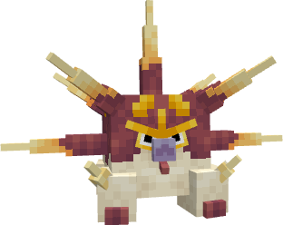
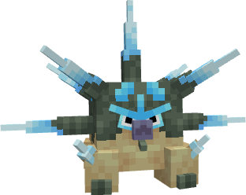

---
layout:
  width: wide
  title:
    visible: true
  description:
    visible: false
  tableOfContents:
    visible: true
  outline:
    visible: true
  pagination:
    visible: true
  metadata:
    visible: true
  tags:
    visible: true
  actions:
    visible: true
  anchors:
    visible: true
---

# #2038 - Overqwatt


{% column width="50%" %}
<a href="./" class="button secondary small">&#x3C;—––</a>

Zobacz jak wygląda (Spoiler)

<figure><figcaption></figcaption></figure>

SHINY!! (Spoiler)

<figure><figcaption></figcaption></figure>



{% column width="50.000000000000014%" %}
***

<mark style="color:$info;">Gatunek</mark> Pokémon Kolec Ziemny

***

<mark style="color:$info;">Waga</mark> 54.0 kg (119.1 lbs)

***

<mark style="color:$info;">Type</mark>  Ground /  Electric

***

<mark style="color:$info;">Abilities</mark> Static[^1]\
&#x20;             [Sand Rush](#user-content-fn-2)[^2]\
&#x20;             Electromorphosis[^3] <mark style="color:$info;">(Hidden Ability)</mark>

***

<mark style="color:$info;">Local №</mark> #0038

***

<mark style="color:$info;">Spawn</mark> Desert\* - Uncommon

***



### **Bazowe statystyki**

***


{% column width="16.666666666666664%" %}

<mark style="color:$info;">HP</mark>



{% column width="8.333333333333334%" %}
85


{% column width="75%" %}
▮▮▮▮▮▮▮▮▮



***


{% column width="16.666666666666664%" %}

<mark style="color:$info;">Attack</mark>



{% column width="8.333333333333334%" %}
115


{% column width="75%" %}
▮▮▮▮▮▮▮▮▮▮▮▮



***


{% column width="16.666666666666664%" %}

<mark style="color:$info;">Defence</mark>



{% column width="8.333333333333334%" %}
105


{% column width="75%" %}
▮▮▮▮▮▮▮▮▮▮▮



***


{% column width="16.666666666666664%" %}

<mark style="color:$info;">Sp. Atk</mark>



{% column width="8.333333333333334%" %}
55


{% column width="75%" %}
▮▮▮▮▮▮



***


{% column width="16.666666666666664%" %}

<mark style="color:$info;">Sp. Def</mark>



{% column width="8.333333333333334%" %}
75


{% column width="75%" %}
▮▮▮▮▮▮▮▮



***


{% column width="16.666666666666664%" %}

<mark style="color:$info;">Speed</mark>



{% column width="8.333333333333334%" %}
75


{% column width="75%" %}
▮▮▮▮▮▮▮▮



***


{% column width="16.666666666666664%" %}

<mark style="color:$info;">Total</mark>



{% column width="16.666666666666664%" %}
**510**


{% column width="66.66666666666667%" %}




### **Odporności na inne typy**

<mark style="color:$info;">Efektywność każdego typu na Overqwatt'a<mark style="color:$info;">

<table data-header-hidden><thead><tr><th width="80" align="center"></th><th width="80" align="center"></th><th width="80" align="center"></th><th width="80" align="center"></th><th width="80" align="center"></th><th width="80" align="center"></th><th width="80" align="center"></th><th width="80" align="center"></th><th width="80" align="center"></th></tr></thead><tbody><tr><td align="center"></td><td align="center"></td><td align="center"></td><td align="center"></td><td align="center"></td><td align="center"></td><td align="center"></td><td align="center"></td><td align="center"></td></tr><tr><td align="center"></td><td align="center"></td><td align="center"><mark style="color:$success;">2</mark></td><td align="center"><mark style="color:$info;">0</mark></td><td align="center"><mark style="color:$success;">2</mark></td><td align="center"><mark style="color:$success;">2</mark></td><td align="center"></td><td align="center"><mark style="color:$warning;">½</mark></td><td align="center"><mark style="color:$success;">2</mark></td></tr><tr><td align="center"></td><td align="center"></td><td align="center"></td><td align="center"></td><td align="center"></td><td align="center"></td><td align="center"></td><td align="center"></td><td align="center"></td></tr><tr><td align="center"><mark style="color:$warning;">½</mark></td><td align="center"></td><td align="center"></td><td align="center"><mark style="color:$warning;">½</mark></td><td align="center"></td><td align="center"></td><td align="center"></td><td align="center"><mark style="color:$warning;">½</mark></td><td align="center"><mark style="color:$warning;">½</mark></td></tr></tbody></table>

### **Drzewko ewolucyjne**

<h4 align="center"><a href="2037-qwilwatt.md">Qwilwatt</a>     —>     <a href="2038-overqwatt.md">Overqwatt</a>         (learn Dig)        </h4>



### **Trening**

<mark style="color:$info;">EV Yield</mark> 2 Attack

<mark style="color:$info;">Catch Rate</mark> 45 <mark style="color:$info;">(5.9% with Pokeball, Full HP)</mark>



### **Breeding**

<mark style="color:$info;">Egg Groups</mark> Field

<mark style="color:$info;">Gender</mark> <mark style="color:blue;">50% male</mark>, <mark style="color:pink;">50% female</mark>



<h3 align="center"><strong>Ruchy Overqwatt'a</strong></h3>


{% column width="50%" %}
#### Uczone poprzez Ewolucje

 [Quake Force](#user-content-fn-4)[^4]

#### Uczone poprzez Level-Up

<mark style="color:$info;">1</mark>   Tackle\
<mark style="color:$info;">1</mark>   Defense Curl\
<mark style="color:$info;">4</mark>   Mud-Slap\
<mark style="color:$info;">8</mark>   Bite\
<mark style="color:$info;">12</mark>   Pin Missile\
<mark style="color:$info;">16</mark>   Rollout\
<mark style="color:$info;">20</mark>   Spikes\
<mark style="color:$info;">24</mark>   Spark\
<mark style="color:$info;">28</mark>   [Quill Shock](#user-content-fn-5)[^5]\
<mark style="color:$info;">32</mark>   Dig\
<mark style="color:$info;">36</mark>   Stealth Rock\
<mark style="color:$info;">40</mark>   Discharge\
<mark style="color:$info;">44</mark>   Drill Run\
<mark style="color:$info;">48</mark>   Crunch\
<mark style="color:$info;">52</mark>   Sword Dance\
<mark style="color:$info;">56</mark>   Earthquake

#### Uczone poprzez Breeding

 Acupressure\
 Charge\
 Counter\
 Curse\
 Endeavor\
 Flail\
 Headbutt\
 Rock Blast\
 Self-Destruct\
 Super Fang


{% column width="49.999999999999986%" %}
#### Uczone poprzez TM

 Agility\
 Brick Brake\
 Bulldoze\
 Crunch\
 Dig\
 Discharge\
 Double-Edge\
 Earth Power\
 Earthquake\
 Endure\
 Facade\
 Giga Impact\
 Gyro Ball\
 Lash Out\
 Mud Shot\
 Pin Missile\
 Protect\
 Rest\
 Rock Tomb\
 Sandstorm\
 Shock Wave\
 Sleep Talk\
 Smart Strike\
 Spikes\
 Stealth Rock\
 Stomping Tantrum\
 Stone Edge\
 Substitute\
 Take Down\
 Taunt\
 Thunder Wave\
 Trailblaze\
 Volt Switch\
 Wild Charge



[^1]: Jeśli Pokémon z _Static_ zostanie uderzony przez ruch kontaktowy, wtedy jest szansa 30%, że przeciwnik dostanie paraliż

[^2]: _Sand Rush_ podwaja Speed użytkownika podczas sandsorm'a

[^3]: Jeśli Pokemon z _Electromorphosis_ jest uderzony przez atak to jego nastepny Electric-type ruch ma podwojoną moc

[^4]: **| Physical | 80 BP | 10 PP | 100% Accuracy |** Moc tego ruchu się zwiększa i zadaje damage wszystkim Pokémonom przeciwnika podczas sandstorma, do tego ma 50% na paraliż podczas electric terrain

[^5]: **| Physical | 25 BP | 20 PP | 95% Accuracy |** _Quill Shock bije 2-5 razy._
